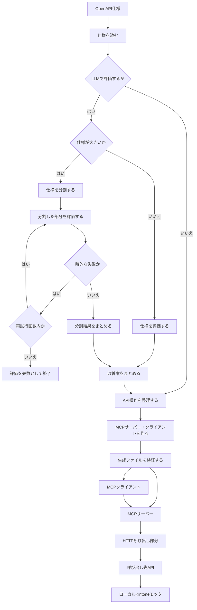
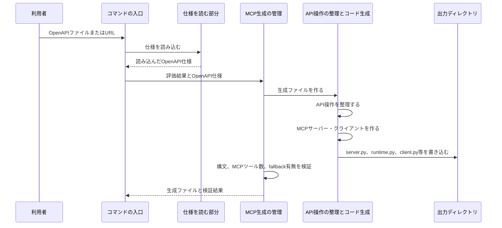
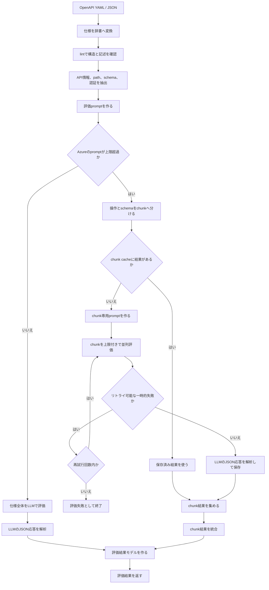
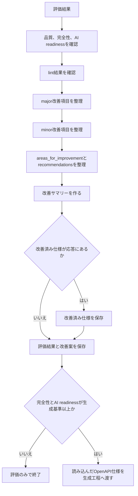
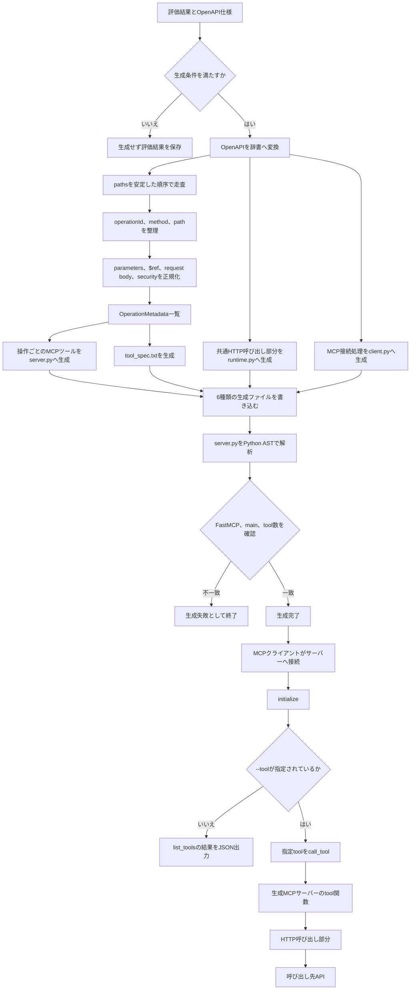
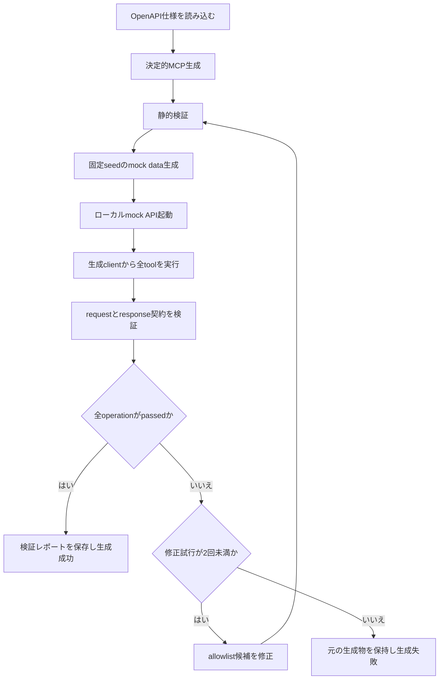
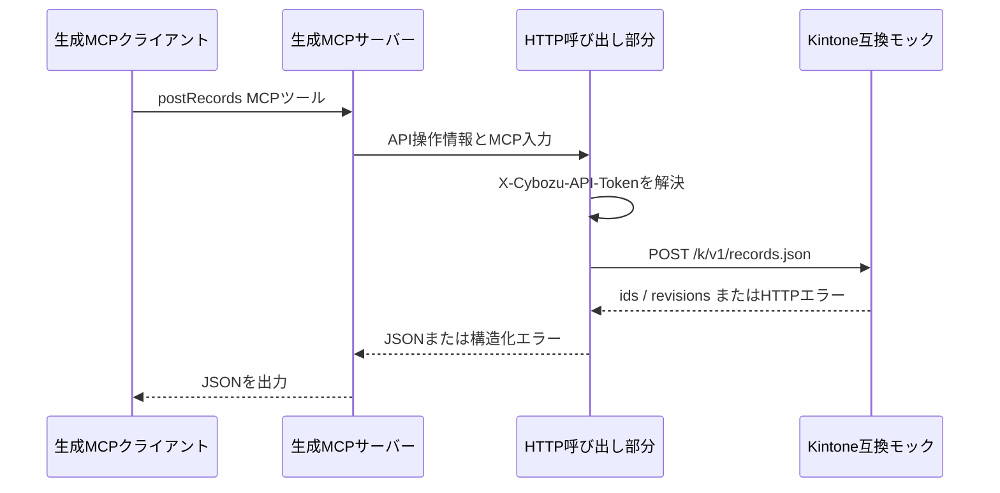

# アーキテクチャ

## 概要

このプロジェクトは、OpenAPI / Swagger仕様からMCPサーバーとMCPクライアントを作ります。通常の生成方法は決定的なコード生成です。同じOpenAPI仕様からは、API操作の順序、MCPツール名、HTTPリクエストの組み立てが同じになるように設計されています。

LLMを使う場合は、仕様の内容を調べて評価し、説明不足・例不足・エラー説明不足などの改善案をまとめます。大きな仕様は分割して評価し、一時的なLLMエラーが起きた場合だけ上限付きで再試行します。評価結果を無制限に再評価するループはありません。MCP生成はOpenAPIの構造を直接整理して行い、生成後にPython構文、FastMCPの起動点、API操作数とMCPツール数、fallback生成物でないことを検証します。さらに既定で固定seedのモックAPIを使った動作検証を行い、失敗時だけ生成物を最大2回まで限定修正します。

## システム構成



### 主なコンポーネント

| 構成要素 | 主な実装 | 役割 |
| --- | --- | --- |
| コマンドの入口 | [`src/cli.py`](../src/cli.py) | ファイルやURLを受け取り、評価、生成、結果保存を順番に実行する |
| 仕様を読む部分 | [`src/services/spec_loader.py`](../src/services/spec_loader.py) | YAML / JSON / URLからOpenAPI仕様を読み込む |
| 仕様の評価と改善案 | [`src/services/openapi_enhancer.py`](../src/services/openapi_enhancer.py)、[`src/services/llm_client.py`](../src/services/llm_client.py) | 仕様の説明、例、エラー対応、認証などを調べ、評価結果と改善案を作る |
| MCP生成の管理 | [`src/services/mcp_generator.py`](../src/services/mcp_generator.py) | MCP生成方法を選び、生成ファイルとAPI操作数を検証する |
| API操作の整理とコード生成 | [`src/services/openapi_mcp_codegen.py`](../src/services/openapi_mcp_codegen.py) | OpenAPIのAPI操作を整理し、MCPサーバー・クライアントのソースを作る |
| HTTP呼び出し部分 | [`src/services/generated_mcp_runtime.py`](../src/services/generated_mcp_runtime.py) | URL、header、query、cookie、本文を組み立て、呼び出し先APIを呼ぶ |
| MCPクライアント | [`src/services/generated_mcp_client.py`](../src/services/generated_mcp_client.py) | MCPサーバーへの接続、MCPツール一覧、MCPツール呼び出し、JSON出力を行う |
| 転記先モック | [`examples/kintone_stub_server.py`](../examples/kintone_stub_server.py) | 認証付きのメモリ内Kintone互換APIと異常応答を再現する |

## MCP生成の流れ



### 1. 仕様を読む

`src/cli.py` がファイル名またはURLを受け取り、仕様を読む部分がOpenAPI仕様をプログラムで扱える形にします。評価を有効にした場合は、評価結果と改善案を結果ディレクトリへ保存します。LLMから改善済み仕様が返された場合だけ、その仕様も保存します。

## 仕様の評価と改善案

### 1. 仕様を評価する

評価は、OpenAPI仕様を読んだうえで、MCPツールとして使うために情報が足りているかを確認する処理です。実際の処理は次の順番です。



確認する内容は次のとおりです。

- APIや各操作の説明が十分か
- パラメータの意味、形式、必須・任意が書かれているか
- 成功時とエラー時の応答が説明されているか
- 一覧取得のページ分けや絞り込みが説明されているか
- 認証方式と必要な権限が分かるか
- OpenAPIの基本構造や記述ルールに違反していないか

評価結果には点数、問題点、改善案、lint結果、LLM利用量が含まれます。評価処理は次の2通りです。

1. 小さな仕様は、仕様全体を1回で評価します。
2. Azure OpenAIで大きすぎる仕様は、API操作やschemaを複数の部分に分け、各部分を評価してから結果をまとめます。

分割評価では、各部分の評価を同時に進めます。一時的なproviderエラーだけは設定された回数まで再試行し、再試行しても失敗した場合は評価全体を失敗として終了します。キャッシュが有効な場合は、同じ部分の保存済み結果を再利用します。

小さな仕様ではLLMのJSON応答を解析して評価結果モデルにします。大きな仕様では、chunkごとのJSON応答を解析してから統合し、同じ評価結果モデルにします。どちらの経路でもlint結果、評価点、問題点、改善案、LLM利用量を評価結果へ含めます。

### 2. 改善案をまとめる

改善案をまとめる処理は、評価結果から優先度付きの問題点と要約を作る段階です。評価結果を使って仕様を無制限に書き換え、再評価する処理ではありません。



改善サマリーには、評価完了の有無、全体品質、完全性スコア、AI readinessスコア、major / minor改善項目数、lintスコアとlint件数を記録します。LLMの応答に`enhanced_openapi_spec`が含まれる場合だけ、改善済み仕様を別ファイルへ保存します。現在のCLIは、MCP生成には読み込んだOpenAPI仕様を渡し、改善済み仕様の自動再評価や自動置換は行いません。

MCP生成へ進む条件は、設定された`generate_mcp_threshold`（既定値`3.0`）以上の完全性スコアとAI readinessスコアです。`--eval-only`が指定された場合も、評価結果と改善案の保存までで終了します。

### 3. MCPサーバー・クライアントを作る

MCP生成では、OpenAPIのAPI操作を正規化してから、サーバー、HTTP呼び出し部分、クライアントなどの生成ファイルを書き込み、サーバーの内容を検証します。



このフローでは、OpenAPIのAPI操作1件につきMCPツールを1つ作ります。`operationId`がない場合はHTTP methodとpathから名前を作り、重複する名前やPython予約語は衝突しないように調整します。生成後は、Python構文、FastMCPのimport、`main()`、API操作数とMCPツール数、fallback生成物でないことを確認します。

### 4. 生成物の動作検証と限定修正

生成CLIは次の順序で生成物を判定します。



モック値は`example`、`enum`、`default`、schema制約、ローカル`$ref`を優先して決定的に
生成します。requestのmethod、path、query、bodyと、成功・HTTPエラー・接続・timeout・
invalid JSONの結果を検証し、schemaがない箇所は`unvalidated`として成功扱いにしません。

修正対象は`server.py`、`client.py`、`runtime.py`だけです。候補を全検証する前に元の
生成物へ反映せず、OpenAPI入力と`enhanced_openapi_spec`は変更しません。結果は
`mcpserver/verification/verification_report.json`と`verification_summary.md`に保存し、
失敗時も評価結果へ検証status・failure code・修正試行数を記録します。

Kintoneの請求書転記のように、動的フォームや業務状態遷移がOpenAPIに表現されない場合は、
[`tests/test_kintone_mcp_e2e.py`](../tests/test_kintone_mcp_e2e.py)のfixture駆動E2Eを別途実行
します。汎用検証が業務ルールを推測してOpenAPIを変更することはありません。

#### API操作を整理する

[`collect_operations()`](../src/services/openapi_mcp_codegen.py) は、OpenAPIの`paths`を安定した順序で走査し、HTTPのAPI操作ごとに`OperationMetadata`を作成します。整理する内容は次のとおりです。

- `operationId`からPython名とMCPツール名を生成
- `operationId`がない場合はHTTP methodとpathからMCPツール名を生成
- path単位と操作単位のパラメータを統合
- `$ref`を解決
- path、query、header、cookieのAPI上の名前とPython引数名を分離
- リクエスト本文のcontent type、required、schemaを保持
- 仕様全体と操作ごとの認証設定を保持

同名のoperationIdやPython予約語があっても、MCPツール名と引数名が衝突しないように番号を付けます。

#### 生成ファイルを作る

[`write_generated_artifacts()`](../src/services/openapi_mcp_codegen.py) は、1回のAPI操作整理結果から次のファイルを生成します。

```text
mcpserver/
├── server.py         # API操作ごとのMCPツールを持つMCPサーバー
├── runtime.py        # MCPサーバーが使うHTTP呼び出し部分
├── client.py         # MCPサーバーを呼び出すMCPクライアント
├── tool_spec.txt     # MCPツール一覧とAPI操作
├── requirements.txt  # 生成ファイルの依存関係
└── README.md         # 生成ファイルの利用方法
```

`runtime.py` と `client.py` は、それぞれ [`generated_mcp_runtime.py`](../src/services/generated_mcp_runtime.py) と [`generated_mcp_client.py`](../src/services/generated_mcp_client.py) の実装から作られます。これにより、生成ファイルだけを別の場所へ置いても、HTTP呼び出しとMCP接続に必要なコードを持てます。

## 生成MCPサーバーの構造

生成された`server.py`は次の順に動きます。

1. `FastMCP`を初期化します。
2. API操作の情報をPython定数として埋め込みます。
3. API操作ごとに`@mcp.tool()`関数を1つ定義します。
4. MCPツールの入力をHTTP呼び出し用の`path`、`query`、`headers`、`cookies`、`body`へ変換します。
5. `_invoke()`が`GeneratedMcpRuntime.request()`を呼び出します。
6. `StructuredApiError`をMCP利用者向けのJSONへ変換します。
7. `streamable-http`または指定された通信方式で起動します。

生成MCPサーバーの初期設定は次のとおりです。

- 通信方式: `streamable-http`
- MCP接続先: `/mcp/`
- 待ち受けhost: `0.0.0.0`
- 待ち受けport: `MCP_SERVER_LISTEN_PORT`、またはCLIの`--port`
- 呼び出し先APIのbase URL: `API_BASE_URL`、またはCLIの`--base-url`
- timeout: `API_TIMEOUT_SECONDS`、またはCLIの`--timeout`

## HTTP呼び出し部分

[`GeneratedMcpRuntime`](../src/services/generated_mcp_runtime.py) は、MCPツールと呼び出し先APIの境界です。

### リクエスト組み立て

1. `base_url`が空でないことを確認します。
2. `{parameter}`形式のpath parameterをURL encodeして置き換えます。
3. query、header、cookieの必須パラメータを検証します。
4. リクエスト本文をJSONとして渡します。
5. 認証設定から認証headerを作ります。
6. `httpx.Client(trust_env=False)`で呼び出し先APIを呼び出します。

`trust_env=False`により、HTTP呼び出しが環境のHTTP proxy設定に意図せず流れないようにしています。

### 認証

OpenAPIの認証設定は次の意味で処理します。

- 認証設定の配列内の各要素: OR（どれか1つの代替方式）
- 1つの認証設定内のscheme: AND（すべて同時に必要）
- すべてのschemeが設定済みの最初の代替方式を採用
- 利用可能な代替方式がない場合は`configuration`エラー

対応する環境変数の例:

| OpenAPIの認証方式 | 環境変数 |
| --- | --- |
| Kintone API key (`X-Cybozu-API-Token`) | `KINTONE_API_TOKEN` |
| その他のAPI key | `OPENAPI_API_KEY_<SCHEME_NAME>` |
| Bearer | `OPENAPI_BEARER_TOKEN_<SCHEME_NAME>` |
| OAuth2 | `OPENAPI_OAUTH_TOKEN_<SCHEME_NAME>` |
| Basic username | `OPENAPI_BASIC_USERNAME_<SCHEME_NAME>` |
| Basic password | `OPENAPI_BASIC_PASSWORD_<SCHEME_NAME>` |

環境変数の値は生成コードやリクエスト履歴へ埋め込みません。

### 構造化エラー

呼び出し先APIの失敗は、MCP利用者が判定できるJSONへまとめます。

| `kind` | 発生条件 |
| --- | --- |
| `configuration` | base URL、必須パラメータ、リクエスト本文、認証設定が不正 |
| `http` | 呼び出し先APIがHTTP status `400`以上を返した |
| `connection` | 呼び出し先APIへ接続できなかった |
| `timeout` | HTTP requestがtimeoutした |
| `invalid_json` | 成功応答をJSONとして解釈できなかった |

HTTPエラーでは呼び出し先APIの`code`を`target_code`へ保持します。token、password、request本文、接続先の詳細はエラーメッセージへ出しません。

例:

```json
{
  "error": {
    "kind": "http",
    "operation_id": "getRecord",
    "status_code": 404,
    "target_code": "GAIA_RE01",
    "message": "Record was not found"
  }
}
```

## MCPクライアント

[`generated_mcp_client.py`](../src/services/generated_mcp_client.py) は生成MCPサーバーへ接続し、次の操作を提供します。

- `--tool`なし: MCPツール一覧をJSONで出力
- `--tool NAME`: 指定したMCPツールをJSON引数で呼び出す
- `--arguments JSON`: MCPツールへ渡すJSON object
- `--transport streamable-http|sse`: 通信方式を選択
- `--output-file FILE`: 結果をファイルにも保存

MCPツール呼び出しが構造化エラーを返した場合、MCPクライアントはJSONを表示し、終了コード`1`を返します。成功時の終了コードは`0`です。

## Kintone転記の実行経路

ローカルKintone検証では、次の経路になります。



実際の入力、Kintoneフィールド形式、正常・異常の出力は [Kintone MCP モック検証結果](KINTONE_MCP_MOCK_RESULTS.md) にまとめています。

## 生成ファイルの確認条件

生成時には次の条件を検証します。

- OpenAPIのAPI操作数と生成MCPツール数が一致する
- `server.py`をPythonとして解析できる
- `FastMCP`の読み込みと`main()`が存在する
- fallbackの印がない
- 生成結果の`operation_count`と`tool_count`が一致する
- 決定的なコード生成ではLLM token使用量が`0`として記録される

条件を満たさない場合、生成処理は成功扱いにせず、CLIもエラーを返します。API操作数を減らして`api_info`だけを返すfallbackは、API連携用の生成ファイルとして扱いません。

## データとセキュリティの境界

- OpenAPI仕様: MCPツールの形、認証方式、呼び出し先APIのパスを定義
- 環境変数: API token、Bearer token、Basic credentialなどのsecretを保持
- 生成されたソース: 環境変数の値を含めない
- HTTP呼び出し部分: secretをheaderへ注入し、エラーへ再出力しない
- Kintoneモックの履歴: tokenの値ではなくheaderの有無だけを記録
- OCR fixture: テスト用データのみを保持し、本番の個人情報やsecretを入れない

本番利用時は、生成されたソース、ログ、MCP応答、呼び出し先APIの監査ログを別々にレビューしてください。

## 関連文書

- [README](../README.md): セットアップ、CLI、実行例
- [生成結果ガイド](RESULTS_GUIDE.md): 出力ファイルの読み方
- [Kintone MCPモック検証結果](KINTONE_MCP_MOCK_RESULTS.md): 実データと実測出力
- [OCR転送connector要件](OCR_TRANSFER_CONNECTOR_REQUIREMENTS.md): OCR転送APIの要件
