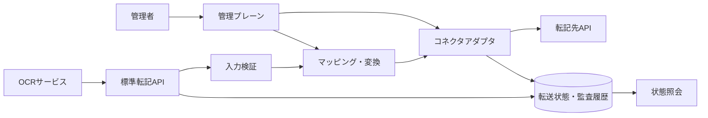

# OCR転記コネクタ標準API 要件定義

- 文書バージョン: 0.2
- ステータス: Draft（レビュー反映済み）
- 対象: OCR結果を、HTTP APIを提供する任意の業務システムへ転記する共通コネクタ

## 1. 目的

OCRサービスごとの出力形式と、転記先システムごとのAPI仕様の差分を吸収し、同じ標準APIから複数の業務システムへ安全にデータを転記できるようにする。

このシステムの責務は次のとおりとする。

1. OCR結果を標準データ形式で受け付ける。
2. 宣言的なマッピング定義に従って転記先のリクエストへ変換する。
3. 転記先APIの認証、入力検証、リクエスト送信、レスポンス解釈を行う。
4. 再試行、冪等性、重複防止、監査、エラー通知を一貫して扱う。
5. 転記先固有の仕様をコネクタアダプタ内に閉じ込め、コアAPIに製品名や固有概念を持ち込まない。

本書は実装済み機能の説明ではなく、次フェーズで実装する標準仕様である。

今回のレビューでは、MVPを「1文書を1つの登録済みREST/HTTP JSON APIへ転記する処理」に限定する。バッチ、multipart、複数転記先へのファンアウトは拡張仕様とする。また、ネットワーク切断後に転記先の成否が分からないケースでは、冪等性だけで重複を完全に防げないため、`reconciliation_required` 状態で自動再送を止める。

## 2. 用語

| 用語 | 定義 |
|---|---|
| OCR結果 | OCRエンジンが抽出した文字列、構造化フィールド、信頼度、位置情報、明細などのデータ |
| コネクタ | 特定の転記先APIとの接続、認証、リクエスト生成、レスポンス解釈を担当するアダプタ |
| マッピング | OCR標準データを転記先APIのパス、クエリ、ヘッダー、リクエストボディへ変換するバージョン付き定義 |
| 転記 | 転記先APIに対して作成、更新、アップサートなどの操作を実行すること |
| 転送ジョブ | 1つのOCR文書を1つのコネクタへ転記する処理単位 |
| 管理プレーン | コネクタ、認証情報参照、マッピング、ポリシーを管理する領域 |
| データプレーン | OCR結果を受け付け、マッピングして転記する実行領域 |

## 3. 対象範囲

### 3.1 対象

- JSON形式で受け取れるOCR結果の転記
- REST/HTTP JSON APIを提供する転記先
- 1文書あたりの単一転記および明細を含む転記
- 作成、更新、アップサート
- APIキー、Bearer token、OAuth 2.0 Client Credentials、Basic認証
- 非同期転送、状態照会、再試行、監査
- 転記先のOpenAPIまたはJSON Schemaに基づく検証

### 3.2 初期対象外

- OCRそのものの実行、画像補正、文字認識モデルの選択
- 転記先業務システムの業務ルールそのものの実装
- 任意のPython、JavaScriptなどを実行する自由形式の変換スクリプト
- 転記先データの削除を伴う同期処理
- 1つの転送ジョブ内での複数転記先へのトランザクション保証
- 複数文書のバッチ転記、複数転記先へのファンアウト
- multipartによる添付ファイル転送
- SFTP、RDB直接接続、SOAPなどHTTP JSON以外のプロトコル

初期対象外の機能は、コネクタアダプタと拡張仕様で追加できる構造にする。

## 4. 設計原則

1. **転記先非依存**: コアAPIのモデル、エラーコード、状態名に特定製品の概念を入れない。
2. **契約優先**: OCR入力、マッピング、コネクタ、転記結果をJSON SchemaとOpenAPIで定義する。
3. **非同期を標準**: 転記先の応答時間に依存せず、受付と転記完了を分離する。
4. **少なくとも1回配送**: 配送は at-least-once とする。冪等性キーと転記先の照会で重複を抑制するが、転記先の成否が不明な状態で exactly-once を保証しない。
5. **安全側に倒す**: 必須値不足、信頼度不足、認証情報不足、マッピング不整合では転記先を呼び出さない。
6. **再現可能**: 使用した入力、マッピングバージョン、コネクタバージョン、転記先レスポンスを追跡できるようにする。
7. **秘密情報分離**: OCR入力やマッピングにアクセストークン、パスワード、秘密鍵を含めない。

### 4.1 エージェント対応契約の検証

本システムの標準APIはMCPそのものではないが、転記先のOpenAPIを機械的に解釈して実行するため、エージェント対応APIに必要な契約品質をコネクタ登録時に検証する。参照資料の [Making REST APIs Agent-Ready: From OpenAPI to Model Context Protocol Servers for Tool-Augmented LLMs](../refs/Making%20REST%20APIs%20Agent-Ready%20From%20OpenAPI%20to%20Model.pdf) で報告された失敗要因を、次の必須チェックへ反映する。

参照研究では、実行対象のOpenAPI operationの自動生成成功率が初回約77%で、認証定義、base URL、未文書化ヘッダー、operation単位の認証、パラメータ型を仕様側で補正すると約99.9%まで改善したと報告されている。この数値を本システムのSLOとはせず、転記先契約を公開前に検証する設計判断の根拠として扱う。

- `servers.url` またはコネクタのbase URLは絶対URLであり、未解決のテンプレート、相対パス、空文字を許可しない。
- すべての操作は `(HTTP method, path)` 単位で一意に識別できる `operationId` を持つ。欠落時の自動生成規則も固定する。
- `$ref` を再帰的に解決し、パラメータ、リクエストボディ、成功レスポンス、エラーレスポンスの実効スキーマを取得する。
- セキュリティ方式はグローバル定義だけでなく、各operationに適用された `security` を評価する。未指定、上書き、認証不要を区別する。
- 認証ヘッダー名、トークン接頭辞、追加必須ヘッダー、APIバージョンヘッダーをコネクタ設定またはOpenAPIで明示する。
- パス、クエリ、ヘッダー、ボディのパラメータ位置、型、必須性を実際のリクエスト生成結果と照合する。
- 書き込みoperationは成功レスポンスのスキーマ、転記先IDの抽出規則、代表的な4xx/5xxエラーを必須とする。
- `operationId`、入力スキーマ、出力スキーマ、認証方式の変更はコネクタの変更検知対象とする。

コネクタを公開する前に、読み取りoperation、作成、更新、アップサートを対象とした契約検証を実行する。書き込み検証は本番データを変更しないサンドボックス、ドライラン、または隔離テナントで行い、成功HTTPステータスだけでなく、作成後の照会などの事後条件も確認する。

将来MCPアダプタを提供する場合は、対象operationごとに安定したツール名、入力JSON Schema、出力JSON Schemaを生成し、MCPサーバーのロード、ツール呼び出し、実際のHTTP応答、書き込み後の状態を個別に検証する。これは転記コアAPIの必須依存にはしない。

## 5. システム構成



コア実行エンジンは、コネクタに次の責務だけを委譲する。

- 転記先リクエストの組み立て
- 転記先認証の適用
- 転記先APIへの送信
- レスポンスから転記先ID、状態、エラーを抽出
- 転記先固有の一時エラー・恒久エラー判定

## 6. 標準OCRデータ形式

### 6.1 転記受付リクエスト

標準APIは、OCRエンジンのベンダー固有形式を直接受け取らず、次の形式に正規化されたデータを受け付ける。

```json
{
  "schema_version": "ocr-transfer/v1",
  "document": {
    "document_id": "doc-20260918-000001",
    "document_type": "invoice",
    "source_system": "ocr-service-a",
    "occurred_at": "2026-09-18T04:00:00Z",
    "content": {
      "media_type": "application/pdf",
      "filename": "invoice-0001.pdf",
      "sha256": "sha256:...",
      "storage_ref": "object://documents/doc-20260918-000001"
    }
  },
  "ocr": {
    "languages": ["ja"],
    "text_ref": "object://ocr-text/doc-20260918-000001",
    "fields": {
      "invoice_number": {
        "raw_value": "INV-0001",
        "value": "INV-0001",
        "value_type": "string",
        "confidence": 0.98,
        "status": "extracted",
        "source": {
          "page": 1,
          "bbox": [0.10, 0.12, 0.28, 0.16]
        }
      },
      "total_amount": {
        "raw_value": "￥12,000",
        "value": 12000,
        "value_type": "number",
        "unit": "JPY",
        "confidence": 0.94,
        "status": "extracted",
        "source": {
          "page": 1,
          "bbox": [0.72, 0.84, 0.92, 0.89]
        }
      }
    },
    "line_items": [
      {
        "fields": {
          "description": {
            "raw_value": "商品A",
            "value": "商品A",
            "value_type": "string",
            "confidence": 0.91,
            "status": "extracted"
          },
          "quantity": {
            "raw_value": "2",
            "value": 2,
            "value_type": "number",
            "confidence": 0.99,
            "status": "extracted"
          }
        }
      }
    ]
  },
  "delivery": {
    "connector_id": "finance-api-prod",
    "mapping_id": "invoice-v1",
    "operation": "upsert",
    "deduplication_key_path": "/ocr/fields/invoice_number/value"
  },
  "metadata": {
    "tenant_id": "tenant-001",
    "correlation_id": "corr-001",
    "labels": {
      "department": "accounting"
    }
  }
}
```

### 6.2 必須項目

- `schema_version`: 後方互換性を判定するための形式バージョン
- `document.document_id`: OCR元で一意な文書ID
- `document.document_type`: 請求書、注文書などの論理種別
- `document.source_system`: OCR結果を作成したシステム識別子
- `ocr.fields` または `ocr.line_items`: 抽出結果。空の場合は受付可だが転記前に検証で失敗させる
- `delivery.connector_id`: サーバー側に登録されたコネクタID
- `delivery.mapping_id`: 使用するマッピング定義ID
- `metadata.tenant_id`: 送信元の補助情報として利用できる。認可コンテキストから解決したテナントIDを正とし、値が存在して一致しない場合は拒否する
- `metadata.correlation_id`: 呼び出し元から引き継ぐ追跡ID

### 6.3 フィールド値の規則

- `value` は文字列、数値、真偽値、日時、配列、オブジェクトを表現できるJSON値とする。
- `raw_value` はOCRが読み取った元の表現を保持する。
- `value` は正規化後の値、`raw_value` は監査・再変換用の値として扱う。
- `confidence` は `0.0` 以上 `1.0` 以下とする。
- `status` は `extracted`、`missing`、`ambiguous`、`invalid`、`manually_corrected` のいずれかとする。
- `source` にページ、矩形、ポリゴン、文字位置などを格納できる。
- OCR結果に個人情報や機密情報が含まれる場合、インライン値と外部参照の保持期間を設定可能にする。

### 6.4 標準化の追加規則

- `value_type` は `string`、`integer`、`number`、`boolean`、`date`、`datetime`、`currency`、`object`、`array` のいずれかとする。
- `date` は `YYYY-MM-DD`、`datetime` はRFC 3339、`currency` は数値の `value` とISO 4217の `unit` を組み合わせる。
- `bbox` はページ左上を原点とする相対座標 `[x_min, y_min, x_max, y_max]` とし、各値を `0.0` 以上 `1.0` 以下とする。ピクセル座標が必要な場合は別フィールドで表現する。
- `storage_ref` と `text_ref` は任意URLではなく、サーバーが許可したストレージ参照の不透明な識別子とする。サーバーはリクエストごとに外部URLを取得しない。
- `schema_version` が未対応の場合は受付を拒否し、対応するバージョンをエラーに含める。
- `document.document_id` の一意性は、認可コンテキストの `tenant_id` と `document.source_system` の組み合わせで評価する。

## 7. 標準API要件

### 7.1 API共通要件

- APIのベースパスは `/v1` とする。
- すべてのリクエストとレスポンスはUTF-8 JSONを基本とする。
- 日時はRFC 3339形式、時刻はUTCで保存する。
- `X-Correlation-ID` を受け付け、未指定の場合はサーバーが生成する。
- `Content-Type: application/json` と `Accept: application/json` を基本とする。
- `POST /v1/transfers` は `Idempotency-Key` を必須とする。
- `Idempotency-Key` は1文字以上256文字以下の不透明な文字列とし、サーバーは少なくとも24時間保持する。保持期間は設定で延長できる。
- エラーは `Content-Type: application/problem+json` のProblem Details形式で返す。
- 標準APIの正規契約はOpenAPI 3.1.0で提供する。OpenAPI 3.0.3互換版を提供する場合は、変換による制約を文書化する。
- 認証済みテナント以外のデータを参照できないようにする。
- 呼び出し元が利用できる `connector_id`、`mapping_id`、文書種別を認可ポリシーで制限する。
- 受付APIにはテナント単位・クライアント単位のレート制限とペイロード上限を適用する。

### 7.2 転送ジョブ受付

`POST /v1/transfers`

- OCR標準データと転送先指定を受け付ける。
- デフォルトは非同期処理とし、正常受付時は `202 Accepted` を返す。
- レスポンスには `transfer_id`、`status`、`status_url`、`created_at`、`correlation_id` を含める。
- 同じテナント、同じ `Idempotency-Key`、同じリクエストハッシュの場合は新規転送を作らず、元の受付結果を返す。
- 同じキーで内容が異なる場合は `409 Conflict` とする。
- 認証、JSON構文、サイズ、基本スキーマを同期検証する。エラー時は `400`、`401`、`403`、`409`、`413`、`415`、`422`、`429` のいずれかを返す。
- マッピングと転記先検証に時間がかかる場合も、受付後に非同期で実行する。

受付レスポンスの標準形は次のとおりとする。`result` と `error` は状態に応じてどちらか一方だけを返す。

```json
{
  "transfer_id": "tr-20260918-000001",
  "status": "accepted",
  "status_url": "/v1/transfers/tr-20260918-000001",
  "connector_id": "finance-api-prod",
  "mapping_id": "invoice-v1",
  "mapping_version": 3,
  "created_at": "2026-09-18T04:00:01Z",
  "updated_at": "2026-09-18T04:00:01Z",
  "correlation_id": "corr-001",
  "attempt": 0,
  "result": null,
  "error": null
}
```

成功時の `result` は `target_resource_id`、`target_request_id`、`completed_at`、必要に応じた安全なレスポンス参照を含む。`reconciliation_required` の場合は `error` に成否不明の理由と照会方法を含めるが、転記先の機密レスポンス本文は含めない。

### 7.3 転送ジョブ一覧

`GET /v1/transfers`

- テナント、`status`、`connector_id`、期間、`document_id`、`correlation_id` で絞り込める。
- ページングはカーソル方式とし、既定上限と最大上限を定義する。
- 一覧レスポンスは入力本文、OCR値、認証情報を含めず、状態と識別子を中心に返す。

### 7.4 転送状態照会

`GET /v1/transfers/{transfer_id}`

- 現在状態、受付情報、検証結果、マッピング結果、転記結果、再試行回数を返す。
- 成功時は転記先のレコードID、レスポンス参照ID、完了日時を返す。
- 失敗時は安全にマスキングされたエラーコード、対象パス、再試行可否を返す。
- 転記先APIのアクセストークン、パスワード、機密ヘッダー、全文レスポンスは返さない。

### 7.5 再試行・キャンセル

`POST /v1/transfers/{transfer_id}/retry`

- 恒久エラーのジョブは、権限を持つオペレーターだけが明示的に再試行できる。
- 一時エラーは自動再試行し、手動再試行では試行回数ポリシーをリセットしない。
- 成功済みジョブの再試行は、別の転送として扱うか、冪等性キー衝突として拒否する。

`POST /v1/transfers/{transfer_id}/cancel`

- `queued`、`validating`、`waiting_review` のジョブをキャンセルできる。
- `delivering` のリクエストを取り消せない場合は、キャンセル要求を記録し、転記結果を監査対象にする。
- 転記先に送信済みのデータを、キャンセル処理で自動削除しない。

`POST /v1/transfers/{transfer_id}/review`

- `waiting_review` のジョブに対して、権限を持つレビュアーが `approve`、`reject`、`correct` を指定できる。
- `approve` は同じ入力を再検証して `queued` に戻す。
- `correct` は訂正値と訂正理由を監査記録に残し、元のOCR値を破壊せずに再検証する。
- `reject` は `failed` とし、自動転記を行わない。

`POST /v1/transfers/{transfer_id}/reconcile`

- `reconciliation_required` のジョブに対して、転記先の照会結果またはオペレーターの確認結果を登録する。
- 転記先で登録済みと確認できた場合は `succeeded`、未登録と確認できた場合だけ再送を許可する。
- 成否を確認できないまま再送する操作は、別権限と明示的な警告を要求する。

### 7.6 マッピングのプレビュー

`POST /v1/mappings/{mapping_id}/preview`

- OCR標準データを受け取り、転記先に送信せず、変換後のHTTPメソッド、パス、クエリ、ヘッダー名、リクエストボディを確認できるようにする。
- 認証ヘッダーの値、Cookie、秘密情報はプレビューから除外する。
- 必須項目不足、型変換失敗、条件分岐結果、信頼度による保留判定を返す。
- `mapping_id` が指定された `connector_id`、文書種別、テナントで利用可能かを検証する。

### 7.7 管理API

コネクタ、マッピング、認証情報参照、再試行ポリシーは管理プレーンで管理する。

- `GET /v1/connectors`: 利用可能なコネクタのメタデータと機能だけを返し、`connector:read` を要求する。
- `POST /v1/connectors`: `connector_id`、`type=rest-openapi`、`display_name`、絶対 `base_url`、固定済みの `spec` または `spec_ref`、`credential_ref`、許可済み `additional_headers`、タイムアウトポリシーを受け付け、`connector:admin` を要求する。秘密情報の実値は受け付けず、`credential_ref` の存在だけを検証する。
- `POST /v1/connectors/{connector_id}/validate`: OpenAPI契約、base URL、operation単位の認証、パラメータ型、代表的なレスポンスを検証し、`connector:admin` を要求する。書き込み検証はサンドボックスまたはドライランを明示した場合だけ許可する。
- `GET /v1/mappings`: マッピングのID、対象文書種別、バージョン、状態を返し、`mapping:read` を要求する。
- `POST /v1/mappings`: `mapping_id`、`version`、`connector_id`、`document_types`、`operations`、`deduplication_key_path`、`target_schema_ref`、`rules` を受け付け、`mapping:write` を要求する。`target_schema_ref` は登録済みOpenAPIスナップショット内のローカル参照 `openapi:#/<json-pointer>` を使い、後続のOpenAPI事前検証がそのスナップショットに対して解決する。
- `GET /v1/health/live`: プロセスが稼働しているかを返す。
- `GET /v1/health/ready`: キュー、データストア、秘密情報ストアなど必須依存先の準備状態を返す。
- コネクタ登録、認証情報登録、マッピング変更は管理者権限と監査記録を必須とする。

## 8. 転送状態モデル

転送ジョブは次の状態を使用する。

| 状態 | 意味 |
|---|---|
| `accepted` | APIが受付済み |
| `validating` | 入力・マッピング・転記先スキーマを検証中 |
| `waiting_review` | 信頼度不足または業務確認が必要 |
| `queued` | 転記実行待ち |
| `delivering` | 転記先APIへ送信中 |
| `retrying` | 一時エラーのため再試行待ち |
| `reconciliation_required` | 転記先の成否が不明で、自動再送を停止中 |
| `cancellation_requested` | 実行中のジョブにキャンセル要求を記録済み |
| `succeeded` | 転記成功 |
| `partially_succeeded` | バッチまたは明細の一部だけ成功 |
| `failed` | 転記失敗。自動再試行不可または上限到達 |
| `cancelled` | 実行前にキャンセル済み |

状態遷移は監査ログに残し、`succeeded` から別の状態へ戻さない。転記先が部分成功を返した場合は、成功要素と失敗要素を分離して記録する。通信結果不明時は `delivering` から `reconciliation_required` へ遷移し、照会で確認するまで新規作成を再送しない。

標準的な遷移は次のとおりとする。

```text
accepted -> validating
validating -> queued | waiting_review | failed
waiting_review -> queued | failed | cancelled
queued -> delivering | cancelled
delivering -> succeeded | retrying | failed | reconciliation_required | cancellation_requested
retrying -> delivering | failed | reconciliation_required
reconciliation_required -> succeeded | failed | delivering
cancellation_requested -> succeeded | failed | reconciliation_required | cancelled
```

## 9. マッピング要件

### 9.1 宣言的マッピング

マッピングはJSONで保存し、任意コードを実行しない。最低限、次の機能を提供する。

- 入力元JSON Pointerから、`path`、`query`、`header`、`body` のいずれかで表す転記先バインディングへの値コピー
- オブジェクト、配列、明細行の繰り返し変換
- 文字列、整数、数値、真偽値、日付、日時、通貨の型変換
- 前後空白、全角半角、カンマ、通貨記号などの正規化
- デフォルト値、列挙値変換、条件付き出力
- 必須値、null、空文字、欠損の扱い
- 複数フィールドを組み合わせた値の生成
- 転記先レスポンスからのID抽出

マッピングの各項目は少なくとも `source`、`target.location`、`target.name` または `target.pointer`、`required`、`on_missing` を持つ。`body` の場合だけJSON Pointerを使用し、`path`、`query`、`header` は名前で指定する。

```json
{
  "source": "/ocr/fields/invoice_number/value",
  "target": {
    "location": "body",
    "pointer": "/external_id"
  },
  "required": true,
  "on_missing": "error"
}
```

認証ヘッダー、`Host`、`Content-Length`、プロキシ制御ヘッダーはマッピングから設定できない。変換関数は許可リスト方式とし、自由形式のコード、自由形式のテンプレート展開、外部HTTP呼び出し、ファイルアクセスはデフォルトで禁止する。複数フィールドの結合は、許可された `concat` などの組み込み関数で行う。

### 9.2 マッピングのライフサイクル

- マッピングは不変バージョンとして保存し、変更時は新バージョンを作成する。
- 各転送ジョブに使用したマッピングIDとバージョンを記録する。
- 公開前にサンプルOCR、必須項目不足、型不一致、低信頼度、転記先エラーのプレビューを必須とする。
- 未公開、公開、廃止のライフサイクルを持つ。
- 廃止済みマッピングは既存ジョブの状態照会には使用できるが、新規転送には使用しない。
- マッピングは対象の `connector_id`、許可する `document_type`、転記操作、転記先スキーマの識別子・バージョンを宣言する。

マッピング登録情報の最小形は次のとおりとする。

```json
{
  "mapping_id": "invoice-v1",
  "version": 3,
  "status": "published",
  "connector_id": "finance-api-prod",
  "document_types": ["invoice"],
  "operations": ["upsert"],
  "deduplication_key_path": "/ocr/fields/invoice_number/value",
  "target_schema_ref": "openapi:#/components/schemas/InvoiceUpsertRequest",
  "rules": []
}
```

`target_schema_ref` は、登録済みコネクタの固定OpenAPIスナップショットに対するローカルJSON Pointer参照を表す。たとえば `openapi:#/components/schemas/InvoiceUpsertRequest` や `openapi:#/paths/~1invoices/post/requestBody/content/application~1json/schema` を使用できる。

`rules` の内容は入力元JSON Pointerと転記先バインディングの組で表し、登録時に重複する転記先、未定義の必須値、許可されていないヘッダーを検証する。

## 10. コネクタ要件

### 10.1 コネクタ登録情報

コネクタ登録情報の最小形は次のとおりとする。秘密情報の値は保存せず、`credential_ref` だけを保持する。

```json
{
  "connector_id": "finance-api-prod",
  "type": "rest-openapi",
  "display_name": "Finance API",
  "base_url": "https://api.example.com",
  "spec_ref": "finance-api:2026-09-01",
  "credential_ref": "secret://finance-api/prod",
  "additional_headers": [
    {
      "name": "X-Api-Version",
      "value_ref": "config://finance-api/api-version"
    }
  ],
  "policy": {
    "connect_timeout_seconds": 5,
    "read_timeout_seconds": 30,
    "total_timeout_seconds": 60,
    "max_response_bytes": 10485760,
    "max_redirects": 0
  }
}
```

公開のコネクタ登録リクエストは `display_name` を保持し、`spec` または `spec_ref` の一方だけを受け付ける。後続の内部保存では、解決済みの仕様スナップショットやバージョン識別子を別途保持してよいが、公開契約では両方を同時必須にしない。

`base_url` は絶対URLで、登録済みの許可リストに含める。`additional_headers` は認証ヘッダーやHTTP制御ヘッダーを除く非秘密の固定ヘッダー、または許可された設定参照だけを扱う。コネクタ登録時に、仕様の `servers`、認証方式、operation単位の `security`、必須ヘッダーとの整合を検証する。

### 10.2 標準コネクタインターフェース

すべてのコネクタは、少なくとも次の操作を提供する。

```text
validate_config(config) -> validation_result
get_capabilities() -> capabilities
validate_payload(payload, mapping_version) -> validation_result
build_request(payload, mapping_version) -> outbound_request
send(outbound_request, credential_ref) -> outbound_response
parse_response(outbound_response) -> transfer_result
classify_error(outbound_response_or_exception) -> error_classification
reconcile(transfer_context, credential_ref) -> reconciliation_result
```

`reconcile` は送信結果が不明なときに、冪等性キー、外部ID、検索キーなどで転記先の状態を照会するために必須とする。コアエンジンはこのインターフェースだけを呼び出し、転記先固有のSDKやフィールド名に依存しない。

### 10.3 REST/OpenAPIコネクタ

初期実装の標準コネクタはREST/HTTP JSON APIを対象とする。

- OpenAPIまたはJSON Schemaから対象リソース、パラメータ、リクエストボディ、レスポンスを読み取る。
- パスパラメータ、クエリパラメータ、ヘッダー、JSONボディを生成できる。
- MVPでは `application/json` のみを扱う。multipartとファイル参照は拡張capabilityとして予約する。
- 2xxレスポンスを成功として扱い、レスポンスから転記先IDを抽出する。
- 3xxはデフォルトで成功扱いせず、許可されたリダイレクトだけ追従する。
- OpenAPIに記載された認証方式とスコープをコネクタ設定に反映する。
- 使用するOpenAPI、JSON Schema、認証設定、エンドポイントのバージョンを固定し、転記実行中に外部URLから仕様を再取得しない。
- 接続、読み取り、全体のタイムアウト、最大レスポンスサイズ、リダイレクト上限をコネクタ単位で設定する。

### 10.4 転記操作

コアAPIはHTTPメソッドではなく、業務上の操作名を受け付ける。

| 操作 | 標準的な動作 |
|---|---|
| `create` | 転記先に新規リソースを作成する |
| `update` | 転記先IDまたは一意な検索キーで既存リソースを更新する。対象なしの扱いを設定する |
| `upsert` | 検索キーで既存を確認し、存在すれば更新、なければ作成する |
| `batch_upsert` | 拡張仕様。複数データをまとめてアップサートし、部分成功に対応する |

`upsert` は転記先にネイティブ機能がある場合はそれを優先する。検索してから作成する場合は、同じキーの同時実行を検知できる仕組み、409時の再照会、外部IDの保存を必須とする。更新対象なし、複数件一致、作成競合の扱いをコネクタ設定で明示する。削除は初期仕様に含めない。

## 11. 認証・認可

### 11.1 標準対応方式

- APIキー: ヘッダー方式を基本とする。クエリ文字列への埋め込みは原則禁止する。
- Bearer token: `Authorization: Bearer <token>`。
- OAuth 2.0 Client Credentials: トークン取得、期限管理、更新、スコープ指定に対応する。
- Basic認証: TLS接続時のみ許可し、資格情報は秘密情報ストアから取得する。
- mTLS: 初期実装後の拡張候補とし、秘密鍵は秘密情報ストアまたはHSMで管理する。

ユーザー同意が必要なOAuth 2.0 Authorization Codeは、テナント単位またはユーザー単位の委譲が必要な場合に拡張する。サービス間転記のMVPではClient Credentialsを標準とする。

### 11.2 秘密情報管理

- APIリクエスト本文、OCRデータ、マッピング定義に秘密情報を含めない。
- コネクタ設定には秘密情報本体ではなく `credential_ref` だけを保存する。
- 秘密情報はSecret Manager、Vault、KMS連携などの保護された保管先に置く。
- ログ、監査履歴、エラー、プレビュー、メトリクスに秘密情報を出力しない。
- APIキー、トークン、パスワードは画面・APIレスポンスでマスキングする。
- 秘密情報のローテーション時にコネクタを再デプロイせず切り替えられるようにする。

### 11.3 標準API自身の認可

標準APIの利用者にはOIDC/OAuth 2.0または同等の認証を要求し、最低限次のスコープを分ける。

- `transfer:write`
- `transfer:read`
- `transfer:retry`
- `transfer:cancel`
- `transfer:review`
- `transfer:reconcile`
- `mapping:read`
- `mapping:write`
- `connector:read`
- `connector:admin`

テナントIDはトークンのクレームまたはサーバー側の認可コンテキストから決定し、リクエスト本文だけを信用しない。

## 12. 入力検証と信頼度ポリシー

- リクエストJSONをJSON Schemaで検証する。
- `document_id`、`schema_version`、`connector_id`、`mapping_id`を検証する。
- ペイロードサイズ、フィールド数、明細行数、文字列長に上限を設ける。
- マッピング適用前に型、欠損、列挙値、形式を検証する。
- マッピング適用後に転記先のJSON SchemaまたはOpenAPIスキーマで再検証する。
- 必須フィールドの信頼度が設定値未満の場合、自動転記せず `waiting_review` にする。
- `ambiguous`、`invalid`、`missing` の値を、マッピング定義が明示的に許可しない限り転記しない。
- 検証結果はフィールドパス、ルールID、メッセージ、再処理可能性を含める。

初期の信頼度ポリシーは次を推奨する。

- 必須フィールド: `confidence >= 0.90`
- 任意フィールド: `confidence >= 0.70`
- 金額、日付、識別子: フィールドごとに上書き可能
- しきい値未満: `waiting_review`

## 13. 冪等性、重複防止、整合性

- `Idempotency-Key` はテナント内で一意とする。
- 同じキーで異なるペイロードを送った場合は `409 Conflict` とする。
- `document.document_id` と `delivery.deduplication_key_path` から得た値の組み合わせを重複判定に利用できる。
- 転記先が冪等性キーに対応する場合は、同じキーを転記先へ安全な形式で引き継ぐ。
- 転記先が対応しない場合は、検索キーまたは登録済み外部IDで重複を防ぐ。
- ネットワーク切断後に成功レスポンスを受信できなかった場合は `reconciliation_required` にし、照会で未登録と確認できるまで新規作成を再実行しない。
- 転記先が冪等性にも照会にも対応しない `create` は、重複防止不能として本番公開を許可しないか、明示的なリスク承認を必須とする。
- 内部の冪等性レコード作成は原子的に行い、同一キーの同時受付で複数ジョブを作らない。
- 一つの文書に対する転送履歴を保持し、手動再試行と自動再試行を区別する。

## 14. 再試行とエラー処理

### 14.1 エラー分類

| 分類 | 例 | 既定動作 |
|---|---|---|
| 入力エラー | JSON不正、必須値不足、型不一致 | 即時失敗。自動再試行しない |
| 認証・認可エラー | 401、403、期限切れトークン | OAuthトークン期限切れと判定できる場合だけ1回更新。それ以外は失敗 |
| 対象なし | 404 | 失敗。コネクタ設定またはマッピングを確認 |
| 競合 | 409 | アップサートの再照会ポリシーに従う。既定は再照会し、成否不明なら `reconciliation_required` |
| レート制限 | 429 | `Retry-After`を尊重して再試行 |
| 一時的HTTPエラー | 408、425、500、502、503、504 | 指数バックオフとジッターで再試行 |
| 通信エラー | DNS、接続、読み取りタイムアウト | 指数バックオフとジッターで再試行 |
| 転記先業務エラー | 400、422、業務エラーJSON | 失敗。フィールドエラーを保存 |
| 成否不明 | 送信後の接続断、全体タイムアウト、応答形式不明 | `reconciliation_required`。新規作成を盲目的に再送しない |
| 内部エラー | 予期しない例外 | 相関IDを返し、詳細はログと監査へ保存 |

### 14.2 再試行ポリシー

- 最大試行回数、初期待機時間、最大待機時間、ジッター率を設定可能にする。
- 既定値は最大3回、指数バックオフ、最大5分を初期値とする。
- 再試行ごとに `attempt`、`next_retry_at`、分類、待機理由を状態に保存する。
- `Retry-After` がある場合は、システム上限の範囲で優先する。
- 永続的な4xx、検証エラー、認証情報未設定は自動再試行しない。
- リクエストを転記先が受け取った可能性がある通信エラーは、再送せず `reconciliation_required` にする。読み取りや明確に送信前に失敗した通信だけを自動再試行する。
- リトライ上限到達後は `failed` とし、再試行可能な場合だけ手動再試行を許可する。
- 失敗ジョブをデッドレターキューまたは同等の保管領域へ移し、入力とエラーを追跡可能にする。

### 14.3 Problem Details

同期APIエラーはProblem Details形式とする。

`type`、`code`、`status`、`retryable` は安定したエラー契約として管理し、`detail` は秘密情報とOCR本文を含めない。レスポンスのContent-Typeは `application/problem+json` とする。

```json
{
  "type": "https://connector.example/problems/mapping-validation",
  "title": "Mapping validation failed",
  "status": 422,
  "code": "MAPPING_VALIDATION_FAILED",
  "detail": "Required target fields are missing",
  "instance": "/v1/transfers/tr-0001",
  "correlation_id": "corr-001",
  "retryable": false,
  "errors": [
    {
      "source_path": "/ocr/fields/invoice_number/value",
      "target_path": "/body/external_id",
      "rule": "required",
      "message": "Value is required"
    }
  ]
}
```

## 15. セキュリティ、個人情報、データ保持

- 外部通信はTLSを必須とし、証明書検証を無効化できないようにする。
- リクエストごとの任意URLを受け付けず、管理者が登録・承認した接続先だけに送信する。
- 接続先ドメイン、IP、ポート、リダイレクト先を許可リストで制限し、SSRFを防ぐ。DNS解決後にプライベート、ループバック、リンクローカル、クラウドメタデータ用アドレスへの接続を拒否し、再接続時にも再検証する。
- リダイレクトは既定で無効とし、許可する場合も宛先ごとに同じSSRF検証を行う。
- 外向きHTTPの接続数、リクエストレート、レスポンスサイズ、圧縮展開後サイズを制限する。
- テナント、文書、転送結果、監査ログを論理分離する。
- 保存データは暗号化し、OCR原文、画像、個人情報の保持期間を設定可能にする。
- ログは構造化し、OCR本文、添付ファイル、アクセストークン、パスワード、秘密ヘッダーを記録しない。
- 管理操作、認証情報参照、マッピング公開、手動再試行、転送結果を改ざん検知可能な監査ログに残す。
- データ削除要求に対して、原文、正規化値、転送履歴、バックアップの削除方針を定義する。

## 16. 可観測性と運用

### 16.1 ログ

すべてのログに次を含める。

- `timestamp`
- `level`
- `service`
- `tenant_id`（秘匿が必要な場合はハッシュ化）
- `transfer_id`
- `connector_id`
- `mapping_id` とバージョン
- `correlation_id`
- `attempt`
- `duration_ms`
- `status` または `error_code`

リクエスト本文、レスポンス本文、認証情報はデフォルトでログに出力しない。

### 16.2 メトリクス

最低限、次のメトリクスを提供する。

- 受付件数、受付拒否件数
- 状態別転送件数
- 成功率、失敗率、部分成功率
- コネクタ別・エラー分類別の件数
- 転記先レイテンシ、キュー待機時間、処理時間
- 自動再試行回数、デッドレター件数
- `waiting_review` 件数と滞留時間
- 認証更新失敗、レート制限発生数

### 16.3 トレース

OpenTelemetry互換のトレースを採用し、標準API受付、検証、マッピング、認証、転記先HTTP呼び出しを同一のトレースで追跡できるようにする。

## 17. 非機能要件

以下はMVPの初期目標値であり、負荷試験後に確定する。

| 項目 | 初期目標 |
|---|---|
| APIバージョン | `/v1`。後方互換性を維持する |
| 受付レイテンシ | 転記先呼び出しを除き、p95 2秒以内 |
| 状態照会 | p95 500ms以内 |
| 可用性 | 月間99.9%以上 |
| 配送保証 | at-least-once。冪等性により重複登録を防止 |
| 同時実行数 | コネクタ単位で設定可能。転記先のレート制限を超えない |
| JSONペイロード | 初期上限10MB。大きな原文・画像は外部参照 |
| 監査保持 | 初期90日。テナントポリシーで変更可能 |
| タイムアウト | 接続、読み取り、全体を別々に設定可能 |
| 障害復旧 | 未完了ジョブを再起動後に再開できる |

## 18. 受入条件

### AC-001 標準入力

- 2種類以上のOCRサービスから同じ標準形式へ正規化した入力を受け付けられる。
- 文字列、数値、日付、低信頼度、欠損、明細行を表現できる。

### AC-002 対象API非依存

- 2種類以上の異なるREST APIを、コアコードを変更せず、別コネクタ設定とマッピングだけで利用できる。
- コアAPIのレスポンスや状態に特定の業務システム名が現れない。
- コネクタ登録時に、絶対base URL、`$ref` 解決、operationId、operation単位の認証、パラメータ型、成功・エラースキーマを検証できる。

### AC-003 認証

- APIキー、Bearer token、OAuth 2.0 Client Credentialsを使う疎通試験に合格する。
- 認証情報がログ、状態照会、エラー、プレビューに漏れない。
- トークン期限切れ時に、許可された範囲で更新して1回だけ再送できる。
- operationごとに必要な認証方式を適用し、認証不要のoperationと認証必須のoperationを取り違えない。

### AC-004 転記操作

- `create`、`update`、`upsert` を実際のスタブAPIで検証できる。
- パス、クエリ、ヘッダー、JSONボディ、明細配列をマッピングできる。
- 成功レスポンスから転記先IDを抽出し、状態照会で返せる。
- 書き込み後に照会または同等の事後条件を検証し、HTTP 2xxだけでは成功と判定しない。

### AC-005 入力検証とレビュー

- 必須値不足、型不一致、低信頼度の入力は転記先を呼び出さない。
- `waiting_review` の理由と対象フィールドを状態照会で確認できる。
- マッピングプレビューで送信前の変換結果を確認できる。
- レビュアーの承認、訂正、却下が監査記録付きで実行できる。

### AC-006 冪等性

- 転記先が冪等性または照会に対応する場合、同じ `Idempotency-Key` の再送で転送ジョブと転記先レコードが重複しない。
- 同じキーで異なる入力を送ると `409` になる。
- 転記先応答が失われたケースでは `reconciliation_required` になり、照会結果が得られるまで新規作成を再送しない。

### AC-007 エラーと再試行

- 429、5xx、タイムアウト、接続エラーが再試行される。
- 400、401、403、422などの恒久エラーが無限再試行されない。
- `Retry-After`、最大試行回数、デッドレターへの移動が機能する。
- 状態照会で最終エラー、再試行可否、試行回数を確認できる。
- 送信後の通信断を一時エラーとして無条件に再送せず、照会または手動判断へ移せる。

### AC-008 監査と復旧

- 受付、マッピングバージョン、送信、再試行、完了・失敗が追跡できる。
- プロセス再起動後も未完了ジョブを失わず、重複なく再開できる。
- テナント間で入力、結果、ログを参照できない。

### AC-009 エージェント対応契約

- 参照仕様にある各 `(method, path)` が一意に識別でき、入力・出力JSON Schemaを取得できる。
- 未解決のbase URL、`$ref`、必須ヘッダー、operation単位の認証、型不一致を公開前に検出できる。
- 代表的な読み取り・書き込みoperationを実行し、HTTP応答と事後状態を検証できる。

## 19. MVP実装範囲

### MVPに含める

1. `/v1/transfers`、一覧、状態照会、手動再試行、レビュー、照会、ヘルスチェック
2. OCR標準データ形式のJSON Schema
3. 標準APIのOpenAPI 3.1.0仕様と、転記先OpenAPIの契約プリフライト
4. REST/OpenAPI JSONコネクタ
5. APIキー、Bearer token、OAuth 2.0 Client Credentials
6. `create`、`update`、`upsert`
7. JSON PointerとHTTP配置場所を組み合わせた宣言的マッピング
8. 入力・転記先スキーマ検証
9. 信頼度しきい値と `waiting_review`
10. 冪等性、照会、指数バックオフ、Problem Details、監査ログ
11. スタブ転記先を使った受入テスト

### MVP後に検討する

- バッチ転記と明細単位の部分成功
- mTLS、OAuth Authorization Code、ユーザー委譲
- Webhookによる状態通知
- 人手レビュー画面
- 添付ファイルのmultipart転送
- SFTP、SOAP、RDBなどの非HTTP JSONコネクタ
- 複数転記先へのファンアウト
- 転記先との補償処理または同期

## 20. 未決事項

実装着手前に、次の事項をプロダクト要件として確定する。

- 対象テナント数、1日あたりの文書数、ピーク同時実行数
- OCR原文、画像、個人情報の保持期間と保管リージョン
- 人手レビュー画面をMVP後に提供するか。MVPではレビューAPIを提供する
- `upsert` の検索キーを誰が設定・承認するか
- OpenAPIがない転記先に対して、JSON Schemaと手動operation定義をどこまで許容するか
- キュー、データストア、秘密情報ストア、監視基盤の採用
- 受入時に要求する可用性、復旧時間、復旧時点
- 同一文書の複数転記先への順序と失敗時ポリシー